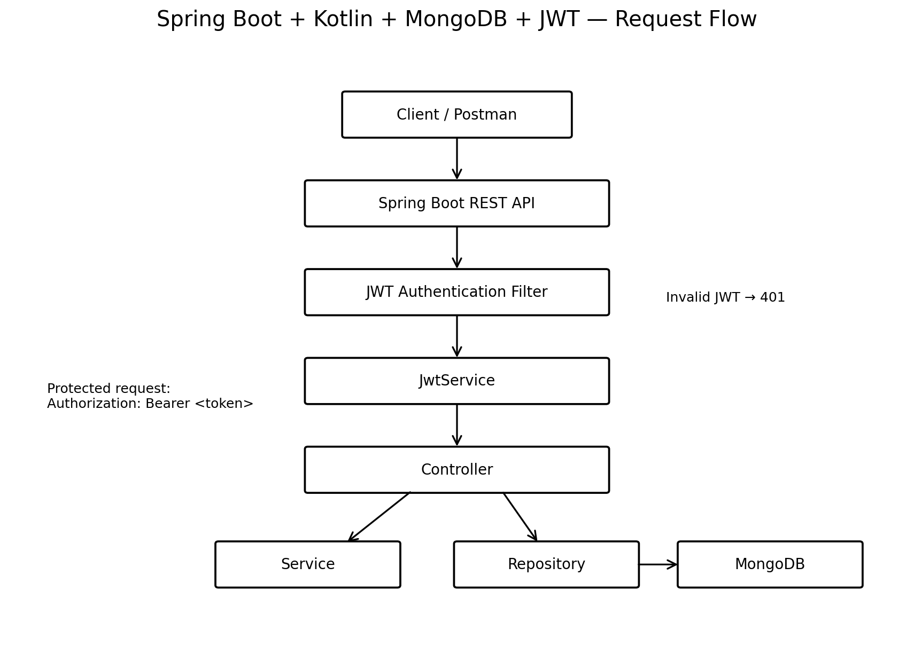
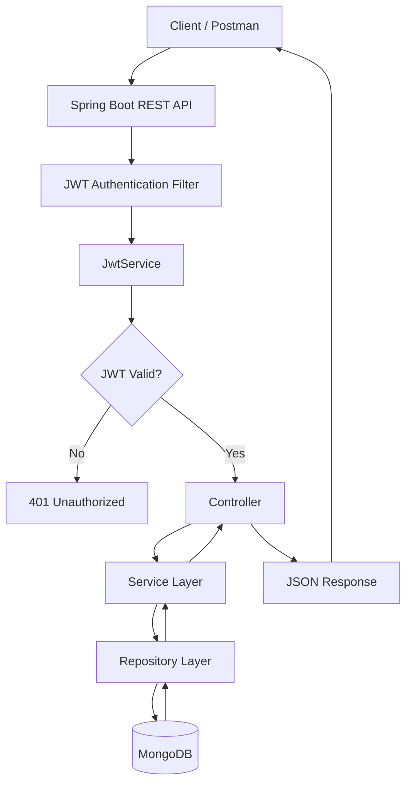

# Spring Boot Crash Course – Kotlin + MongoDB + JWT

## Tech Stack

- Kotlin
- Spring Boot
- Spring Web / REST APIs
- Spring Data MongoDB
- MongoDB
- JJWT
- Gradle
- JWT access and refresh tokens

## Architecture





## Request Flow

```text
Client / Postman
       |
       v
Spring Boot REST API
       |
       v
JWT Authentication Filter
       |
       v
JwtService
       |
       +---- Invalid JWT ----> 401 Unauthorized
       |
       v
Controller
       |
       v
Service
       |
       v
Repository
       |
       v
MongoDB
       |
       v
JSON Response
```

## JWT Authentication Flow

A protected request contains:

```http
Authorization: Bearer <access-token>
```

The authentication flow is:

```text
Client
  |
  | Login
  v
Authentication API
  |
  v
JwtService
  |
  +--> Access Token
  |
  +--> Refresh Token
  |
  v
Client
  |
  | Authorization: Bearer <access-token>
  v
JWT Auth Filter
  |
  v
JwtService
  |
  | Validate signature / expiration / token type
  v
Controller
  |
  v
Service
  |
  v
Repository
  |
  v
MongoDB
```

## Main Components

### Controller

Handles HTTP requests and responses.

```text
HTTP Request → Controller → HTTP Response
```

### Service

Contains application/business logic and coordinates operations between controllers and repositories.

### Repository

Handles persistence and communication with MongoDB through Spring Data MongoDB.

### JwtAuthFilter

Intercepts protected requests, extracts the Bearer token and asks `JwtService` to validate it.

### JwtService

Responsible for:

- Generating access tokens
- Generating refresh tokens
- Validating access tokens
- Validating refresh tokens
- Extracting the user ID from a token

### MongoDB

Stores application data as documents inside collections.

## Configuration

Sensitive values are loaded through environment variables instead of being committed to GitHub.

```properties
spring.application.name=spring_boot_course
server.port=8085

spring.data.mongodb.uri=${MONGODB_CONNECTION_STRING}
spring.data.mongodb.auto-index-creation=true

jwt.secret=${JWT_SECRET_BASE64}
```

Set the variables locally:

```bash
export MONGODB_CONNECTION_STRING="<your-mongodb-connection-string>"
export JWT_SECRET_BASE64="<your-base64-secret>"
```

For an HS256 JWT secret, the decoded key must contain at least 32 bytes (256 bits).

**Never commit real MongoDB credentials or JWT secrets to GitHub.**

## Running the Project

```bash
git clone <your-repository-url>
cd <your-repository-folder>
./gradlew bootRun
```

Application:

```text
http://localhost:8085
```

## Suggested Project Structure

```text
src/main/kotlin/com/akhilbodhade/spring/_boot_course/
├── controller/
├── database/
│   ├── model/
│   └── repository/
├── security/
├── service/
└── SpringBootCourseApplication.kt

src/main/resources/
└── application.properties
```

The structure can evolve as more course features are implemented.

## Learning Goals

This project is being built incrementally to understand:

- Spring Boot application structure
- REST API development
- Dependency injection
- Kotlin backend development
- MongoDB persistence
- Repository and service layers
- JWT authentication
- Access and refresh tokens
- Request filtering
- Configuration and environment variables
- API testing with Postman

## Future Improvements

- Add more REST APIs
- Add validation and centralized exception handling
- Add unit and integration tests
- Add API documentation
- Add Docker support
- Add CI/CD
- Improve authorization
- Improve refresh-token security